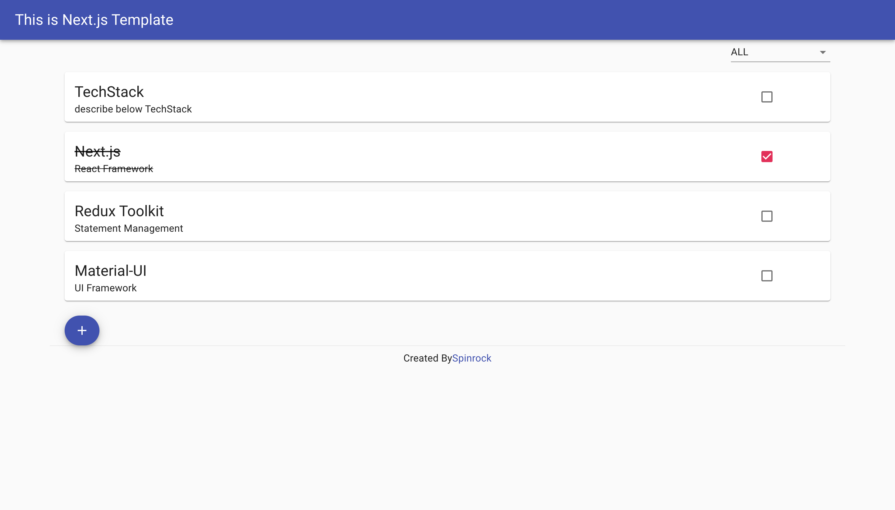

# NextJS Template

Next.js with Typescript の個人用テンプレートとなります

## 利用しているライブラリ群

- [Next.js](https://nextjs.org/)
- [TypeScript](https://www.typescriptlang.org/)
- [Redux Toolkit](https://redux-toolkit.js.org/)
- [Material-UI](https://material-ui.com/ja/)

## 使い方

[`create-next-app`](https://github.com/vercel/next.js/tree/canary/packages/create-next-app) の --example オプションに本リポジトリ URL を指定します

```bash
npx create-next-app <your-app-name> --example https://github.com/spinrock/nextjs-template
# or
yarn create next-app <your-app-name> --example https://github.com/spinrock/nextjs-template
```

## サンプルイメージ

- PC サイズの場合  
  
- スマホサイズの場合  
  
