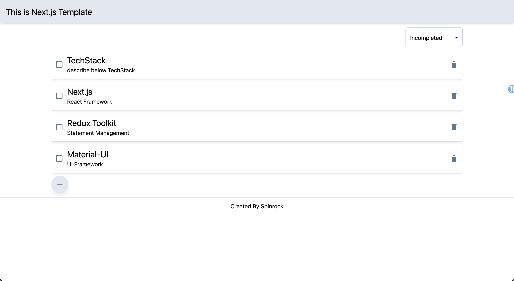
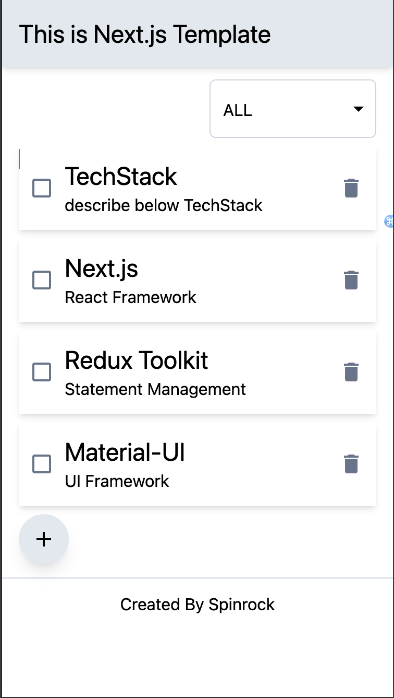

# NextJS Template

Next.js with Typescript の個人用テンプレートとなります

## 利用しているライブラリ群

- App フレームワーク : [Next.js](https://nextjs.org/)
- 言語 : [TypeScript](https://www.typescriptlang.org/)
- 状態管理 : [Redux Toolkit](https://redux-toolkit.js.org/)
- CSS フレームワーク : [Tailwind CSS](https://tailwindcss.com/)
- Linter & Formatter : [Biome](https://biomejs.dev/ja/formatter/)

## 使い方

[`create-next-app`](https://github.com/vercel/next.js/tree/canary/packages/create-next-app) の --example オプションに本リポジトリ URL を指定します

```bash
npx create-next-app <your-app-name> --example https://github.com/spinrock/nextjs-template
# or
yarn create next-app <your-app-name> --example https://github.com/spinrock/nextjs-template
```

## サンプルイメージ

- PC サイズのイメージ

  

- スマホサイズのイメージ

  
